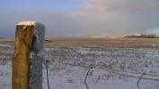
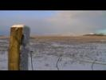
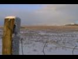
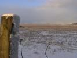
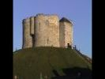

# Digital Television - AFD codes explained

There are many potential problems and misunderstandings surrounding standard definition (SD) digital widescreen television. This article explains how the system is designed to work and should help the end user get the best possible results from their equipment.

In the UK many digital terrestrial television (DTT) broadcasts are true widescreen, that is an 16:9 image within a 4:3 raster as shown in the BBC2 Snooker image below. Some channels are 4:3 as shown underneath.


[16:9 anamorphic, as broadcast](images/16a12.jpg) note the balls are eliptical


[4:3 full frame, as broadcast](images/12f12.jpg) note the logo is round

The snooker widescreen image appears to be horizontally squeezed, often referred to as full height anamorphic (FHA). For this image to be displayed correctly it must be viewed on a 16:9 display which will reverse the horizontal squeeze generated by the camera or transmission system. Unfortunately many people receiving this transmission will not have a 16:9 display. To overcome this problem the set top box (STB) can adjust the image to fit a 4:3 television, although this is always a compromise.

The way in which the 16:9 image should be adapted for a 4:3 display is controlled by the broadcaster by means of signalling embedded in the transmission. The active format descriptor (AFD) describes the portion of the 16:9 image which is important and should therefore be presented to the 4:3 viewer.

The AFD code can be changed on a programme by programme basis for channels that show material from a mixture of genres and production dates. For genre specific channels (eg 24h news) it is normally fixed. The system will only work correctly when the STB correctly knows (by user configuration) the shape of the television it is connected to.

Seven descriptors have been defined, the most common are described below.

Full widescreen image AR 16:9
-----------------------------

  
As shown on a 16:9 display

16:9 letterbox AR 16:9, AFD 10
------------------------------

  
Often used for cinema films where the full width of the 16:9 image is required to avoid missing important details. The black bars are added by the STB.

14:9 letterbox, AR 16:9, AFD 14
-------------------------------

  
Commonly used for general 16:9 programming; made for TV drama, current affairs and entertainment. Some information is lost from the left and right, the black bars are then added by the STB.

Centre cut out, AR 16:9, AFD 15
-------------------------------

  
Only the centre portion of the image is shown, information is lost on the left and right. Often used for sport where the action can be kept in the centre of the image. Also used when the original material is originated in 4:3, for example archive material and international events.

Archive material AR 16:9, AFD 15
--------------------------------

There is still a lot of material in the archives that was made in 4:3, this can never be converted to widescreen. Archive material shot in 4:3 should be shown full screen on a 4:3 display and pillar-boxed on a 16:9 display. Some broadcasters pre-arc 4:3 material making a 4:3 image sit with an anamorphic 16:9 frame. This allows the AR of the network to be fixed to 16:9 and helps to stop viewers with a widescreen display stretching the image.

  
as transmitted, 4:3 image with black bars added by the broadcaster (not the STB) to make 16:9 anamorphic.

  
as displayed on a 16:9 display, the black borders are required to keep the aspect ratio of the image correct.

  
as displayed on a 4:3 display, the black bars are removed by the STB.

Technical details
-----------------

In component serial digital video (D1 SDI) AFD codes are inserted in every frame as part of the video index data on line 11 of the VBI. (see SMPTE RP186 for more information on video index). During encoding the AFD is inserted into the MPEG-2 video picture header. (see ISO/IEC 13818-1 and ETR 154 annex B).

It is important to note that the AFD is only part of the equation, it must be combined with the aspect ratio (AR) of the entire image or raster. The AR can only be 4:3 or 16:9. Most DTT services use a fixed AR with a changing AFD, some services change the AR and the AFD.

A similar but less sophisticated system known as wide screen signalling (WSS) is used by some analogue stations and digital satellite services (DSAT).

Equipment
---------

Unfortunately not all set top boxes comply fully with the AFD specification. Most allow the user to override the AFD signal and set their own preference, for example always output 16:9 letterbox regardless of the AFD value. As part of digital switchover a digital tick scheme has been launched. For equipment to get a digital tick it must (amongst many other things) comply with the AFD specification. 

Analogue
--------

The conversion method used for DTT is often mirrored by the corresponding analogue service, using the same AFD signalling. Here the conversion from 16:9 to 4:3 is done by the broadcaster just before transmission. Analogue services are not suitable for widescreen television sets because the full anamorphic widescreen image is not available.

Some basic rules
----------------

* Analogue broadcasts are intended to be viewed on a 4:3 television.
* Digital SD broadcasts are best viewed on a 16:9 television, but the STB can convert them for display on a 4:3 television.
* A widescreen television set does not magically make all television services widescreen, many channels and programmes are 4:3 and should be viewed as such with black borders on the left and right of the screen.

Complete list of AFD codes
--------------------------

The following list shows all AFD codes defined in DVB standard TS 101 154. Only codes 8 to 15 are permitted for use in UK DTT, as defined in the D-Book.

```
0000 (0) AFD unknown
0001 (1) Reserved
0010 (2) box 16:9 (top)
0011 (3) box 14:9 (top)
0100 (4) box 16:9 (centre)
0101 (5) Reserved
0110 (6) Reserved
0111 (7) Reserved
1000 (8) as coded frame
1001 (9) 4:3 active picture
1010 (10) 16:9 active picture
1011 (11) 14:9 active picture
1100 (12) Reserved
1101 (13) 4:3 with shoot and protect 14:9 centre
1110 (14) 16:9 with shoot and protect 14:9 centre
1111 (15) 16:9 with shoot and protect 4:3 centre
```

References
----------

More technical information is available in these publications.

* SMPTE RP186
* ISO/IEC 13818-1
* TS 101 154
* DTG D-Book

Analysis
--------

For deep technical analysis of the AFD codes in a MPEG-2 transport stream I created a software tool.

[https://github.com/daniep01/MPEG-2-Transport-Stream-Packet-Analyser](https://github.com/daniep01/MPEG-2-Transport-Stream-Packet-Analyser)

Links
-----

More general information is available on these sites.

[Digital TV group](https://dtg.org.uk/)

[DTT in the UK](https://en.wikipedia.org/wiki/Digital_terrestrial_television_in_the_United_Kingdom)

[Freeview](http://www.freeview.co.uk)


